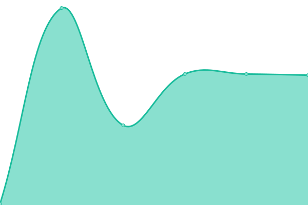

# [📈 Live Status](https://twitch.chiquicalris.me): <!--live status--> **🟥 Complete outage**

This repository contains the open-source uptime monitor and status page for [Chiqui](chiquicalris.me), powered by [Upptime](https://github.com/upptime/upptime).

With [Upptime](https://upptime.js.org), you can get your own unlimited and free uptime monitor and status page, powered entirely by a GitHub repository. We use [Issues](https://github.com/chiquidev/upptime/issues) as incident reports, [Actions](https://github.com/chiquidev/upptime/actions) as uptime monitors, and [Pages](https://twitch.chiquicalris.me) for the status page.

<!--start: status pages-->
<!-- This summary is generated by Upptime (https://github.com/upptime/upptime) -->
<!-- Do not edit this manually, your changes will be overwritten -->
<!-- prettier-ignore -->
| URL | Status | History | Response Time | Uptime |
| --- | ------ | ------- | ------------- | ------ |
|  [100.20.159.232 (Port 80)](100.20.159.232) | 🟥 Down | [100-20-159-232-port-80.yml](https://github.com/chiquidev/upptime/commits/HEAD/history/100-20-159-232-port-80.yml) | 

 77ms
     
 | 

<a href="https://twitch.chiquicalris.me/history/100-20-159-232-port-80">100.00%</a>
    

|  [34.217.198.238 (Port 80)](34.217.198.238) | 🟥 Down | [34-217-198-238-port-80.yml](https://github.com/chiquidev/upptime/commits/HEAD/history/34-217-198-238-port-80.yml) | 

 0ms
     
 | 

<a href="https://twitch.chiquicalris.me/history/34-217-198-238-port-80">100.00%</a>
    

|  [35.82.188.4 (Port 80)](35.82.188.4) | 🟥 Down | [35-82-188-4-port-80.yml](https://github.com/chiquidev/upptime/commits/HEAD/history/35-82-188-4-port-80.yml) | 

 108ms
     
 | 

<a href="https://twitch.chiquicalris.me/history/35-82-188-4-port-80">100.00%</a>
    

|  [35.83.19.234 (Port 80)](35.83.19.234) | 🟥 Down | [35-83-19-234-port-80.yml](https://github.com/chiquidev/upptime/commits/HEAD/history/35-83-19-234-port-80.yml) | 

 135ms
     
 | 

<a href="https://twitch.chiquicalris.me/history/35-83-19-234-port-80">100.00%</a>
    

|  [44.224.228.96 (Port 80)](44.224.228.96) | 🟥 Down | [44-224-228-96-port-80.yml](https://github.com/chiquidev/upptime/commits/HEAD/history/44-224-228-96-port-80.yml) | 

 114ms
     
 | 

<a href="https://twitch.chiquicalris.me/history/44-224-228-96-port-80">100.00%</a>
    

|  [44.226.36.141 (Port 80)](44.226.36.141) | 🟥 Down | [44-226-36-141-port-80.yml](https://github.com/chiquidev/upptime/commits/HEAD/history/44-226-36-141-port-80.yml) | 

 0ms
     
 | 

<a href="https://twitch.chiquicalris.me/history/44-226-36-141-port-80">100.00%</a>
    

|  [44.239.110.244 (Port 80)](44.239.110.244) | 🟥 Down | [44-239-110-244-port-80.yml](https://github.com/chiquidev/upptime/commits/HEAD/history/44-239-110-244-port-80.yml) | 

 0ms
     
 | 

<a href="https://twitch.chiquicalris.me/history/44-239-110-244-port-80">100.00%</a>
    

|  [44.239.252.6 (Port 80)](44.239.252.6) | 🟥 Down | [44-239-252-6-port-80.yml](https://github.com/chiquidev/upptime/commits/HEAD/history/44-239-252-6-port-80.yml) | 

 193ms
     
 | 

<a href="https://twitch.chiquicalris.me/history/44-239-252-6-port-80">100.00%</a>
    

|  [52.10.182.227 (Port 80)](52.10.182.227) | 🟥 Down | [52-10-182-227-port-80.yml](https://github.com/chiquidev/upptime/commits/HEAD/history/52-10-182-227-port-80.yml) | 

 2200ms
     
 | 

<a href="https://twitch.chiquicalris.me/history/52-10-182-227-port-80">100.00%</a>
    

|  [52.33.222.227 (Port 80)](52.33.222.227) | 🟥 Down | [52-33-222-227-port-80.yml](https://github.com/chiquidev/upptime/commits/HEAD/history/52-33-222-227-port-80.yml) | 

 0ms
     
 | 

<a href="https://twitch.chiquicalris.me/history/52-33-222-227-port-80">100.00%</a>
    

|  [54.203.158.65 (Port 80)](54.203.158.65) | 🟥 Down | [54-203-158-65-port-80.yml](https://github.com/chiquidev/upptime/commits/HEAD/history/54-203-158-65-port-80.yml) | 

 0ms
     
 | 

<a href="https://twitch.chiquicalris.me/history/54-203-158-65-port-80">100.00%</a>
    

|  [100.20.159.232 (Port 443, Secure)](100.20.159.232) | 🟥 Down | [100-20-159-232-port-443-secure.yml](https://github.com/chiquidev/upptime/commits/HEAD/history/100-20-159-232-port-443-secure.yml) | 

 76ms
     
 | 

<a href="https://twitch.chiquicalris.me/history/100-20-159-232-port-443-secure">100.00%</a>
    

|  [34.217.198.238 (Port 443, Secure)](34.217.198.238) | 🟥 Down | [34-217-198-238-port-443-secure.yml](https://github.com/chiquidev/upptime/commits/HEAD/history/34-217-198-238-port-443-secure.yml) | 

 0ms
     
 | 

<a href="https://twitch.chiquicalris.me/history/34-217-198-238-port-443-secure">100.00%</a>
    

|  [35.82.188.4 (Port 443, Secure)](35.82.188.4) | 🟥 Down | [35-82-188-4-port-443-secure.yml](https://github.com/chiquidev/upptime/commits/HEAD/history/35-82-188-4-port-443-secure.yml) | 

 110ms
     
 | 

<a href="https://twitch.chiquicalris.me/history/35-82-188-4-port-443-secure">100.00%</a>
    

|  [35.83.19.234 (Port 443, Secure)](35.83.19.234) | 🟥 Down | [35-83-19-234-port-443-secure.yml](https://github.com/chiquidev/upptime/commits/HEAD/history/35-83-19-234-port-443-secure.yml) | 

 130ms
     
 | 

<a href="https://twitch.chiquicalris.me/history/35-83-19-234-port-443-secure">100.00%</a>
    

|  [44.224.228.96 (Port 443, Secure)](44.226.36.141) | 🟥 Down | [44-224-228-96-port-443-secure.yml](https://github.com/chiquidev/upptime/commits/HEAD/history/44-224-228-96-port-443-secure.yml) | 

 0ms
     
 | 

<a href="https://twitch.chiquicalris.me/history/44-224-228-96-port-443-secure">100.00%</a>
    

|  [44.239.110.244 (Port 443, Secure)](44.239.110.244) | 🟥 Down | [44-239-110-244-port-443-secure.yml](https://github.com/chiquidev/upptime/commits/HEAD/history/44-239-110-244-port-443-secure.yml) | 

 0ms
     
 | 

<a href="https://twitch.chiquicalris.me/history/44-239-110-244-port-443-secure">100.00%</a>
    

|  [44.239.252.6 (Port 443, Secure)](44.239.252.6) | 🟥 Down | [44-239-252-6-port-443-secure.yml](https://github.com/chiquidev/upptime/commits/HEAD/history/44-239-252-6-port-443-secure.yml) | 

 95ms
     
 | 

<a href="https://twitch.chiquicalris.me/history/44-239-252-6-port-443-secure">100.00%</a>
    

|  [52.10.182.227 (Port 443, Secure)](52.10.182.227) | 🟥 Down | [52-10-182-227-port-443-secure.yml](https://github.com/chiquidev/upptime/commits/HEAD/history/52-10-182-227-port-443-secure.yml) | 

 1610ms
     
 | 

<a href="https://twitch.chiquicalris.me/history/52-10-182-227-port-443-secure">100.00%</a>
    

|  [52.33.222.227 (Port 443, Secure)](52.33.222.227) | 🟥 Down | [52-33-222-227-port-443-secure.yml](https://github.com/chiquidev/upptime/commits/HEAD/history/52-33-222-227-port-443-secure.yml) | 

 0ms
     
 | 

<a href="https://twitch.chiquicalris.me/history/52-33-222-227-port-443-secure">100.00%</a>
    

|  [54.203.158.65 (Port 443, Secure)](54.203.158.65) | 🟥 Down | [54-203-158-65-port-443-secure.yml](https://github.com/chiquidev/upptime/commits/HEAD/history/54-203-158-65-port-443-secure.yml) | 

 0ms
     
 | 

<a href="https://twitch.chiquicalris.me/history/54-203-158-65-port-443-secure">100.00%</a>
    

|  [34.217.198.238 (Port 6667)](34.217.198.238) | 🟥 Down | [34-217-198-238-port-6667.yml](https://github.com/chiquidev/upptime/commits/HEAD/history/34-217-198-238-port-6667.yml) | 

 0ms
     
 | 

<a href="https://twitch.chiquicalris.me/history/34-217-198-238-port-6667">100.00%</a>
    

|  [44.226.36.141 (Port 6667)](44.226.36.141) | 🟥 Down | [44-226-36-141-port-6667.yml](https://github.com/chiquidev/upptime/commits/HEAD/history/44-226-36-141-port-6667.yml) | 

 0ms
     
 | 

<a href="https://twitch.chiquicalris.me/history/44-226-36-141-port-6667">100.00%</a>
    

|  [100.20.159.232 (Port 6697, Secure)](100.20.159.232) | 🟥 Down | [100-20-159-232-port-6697-secure.yml](https://github.com/chiquidev/upptime/commits/HEAD/history/100-20-159-232-port-6697-secure.yml) | 

 149ms
     
 | 

<a href="https://twitch.chiquicalris.me/history/100-20-159-232-port-6697-secure">100.00%</a>
    

|  [34.217.198.238 (Port 6697, Secure)](34.217.198.238) | 🟥 Down | [34-217-198-238-port-6697-secure.yml](https://github.com/chiquidev/upptime/commits/HEAD/history/34-217-198-238-port-6697-secure.yml) | 

 0ms
     
 | 

<a href="https://twitch.chiquicalris.me/history/34-217-198-238-port-6697-secure">100.00%</a>
    

|  [44.226.36.141 (Port 6697, Secure)](44.226.36.141) | 🟥 Down | [44-226-36-141-port-6697-secure.yml](https://github.com/chiquidev/upptime/commits/HEAD/history/44-226-36-141-port-6697-secure.yml) | 

 0ms
     
 | 

<a href="https://twitch.chiquicalris.me/history/44-226-36-141-port-6697-secure">100.00%</a>
    

<!--end: status pages-->

[**Visit our status website →**](https://twitch.chiquicalris.me)

## 📄 License

- Powered by: [Upptime](https://github.com/upptime/upptime)
- Code: [MIT](./LICENSE) © [Chiqui](chiquicalris.me)
- Data in the `./history` directory: [Open Database License](https://opendatacommons.org/licenses/odbl/1-0/)
